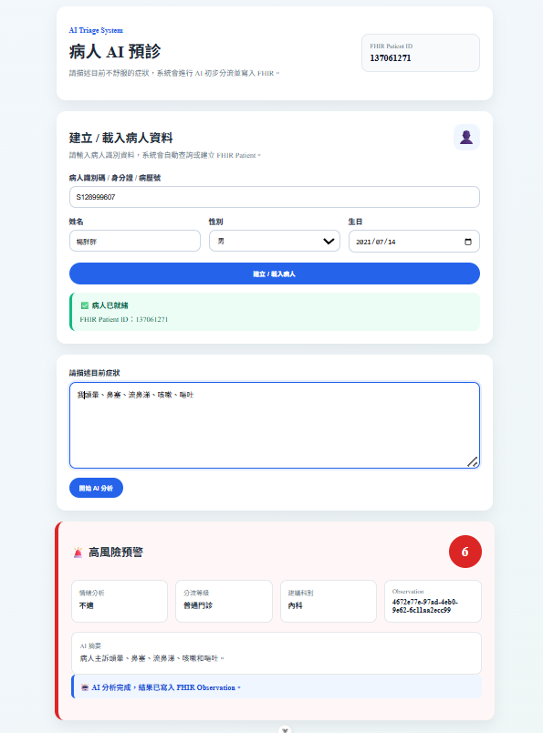

# AI-Triage-System

An AI-powered medical triage platform integrating Google Gemini, HL7 FHIR R4, CDS Hooks and HAPI FHIR Server to support clinical decision making.

---

## Project Overview

This project simulates a real-world healthcare workflow where patients submit chief complaints through a patient application, AI analyzes the symptoms, converts results into standard FHIR resources and provides clinical decision support to physicians through an EHR dashboard.

The project aims to demonstrate healthcare interoperability, AI-assisted triage and clinical workflow integration using international healthcare standards.

---
## System Architecture

```text
┌────────────────────┐
│ Patient App (Vue)  │
└─────────┬──────────┘
          │ Chief Complaint
          ▼
┌────────────────────┐
│ Express Backend    │
└─────────┬──────────┘
          │ Prompt
          ▼
┌────────────────────┐
│ Google Gemini API  │
└─────────┬──────────┘
          │ AI Result
          ▼
┌────────────────────┐
│ FHIR Resource      │
│ Builder            │
└─────────┬──────────┘
          │ Transaction Bundle
          ▼
┌────────────────────┐
│ HAPI FHIR Server   │
└─────────┬──────────┘
          │ Query
          ▼
┌────────────────────┐
│ Doctor EHR System  │
└─────────┬──────────┘
          │
          ▼
┌────────────────────┐
│ CDS Hooks Alert    │
└────────────────────┘
```
## FHIR Resource Relationship

```text
Patient
   │
   ├── Observation
   │      ├── Urgency Score
   │      ├── Emotion
   │      ├── Recommended Department
   │      └── AI Summary
   │
   ├── Encounter
   │
   └── Provenance
          │
          └── Google Gemini
```
## Technology Stack
### Frontend

- Vue 3
- Composition API
- Axios
- Bootstrap

### Backend

- Node.js
- Express.js
- RESTful API

### AI Integration

- Google Gemini API
- Prompt Engineering
- JSON Parsing

### Healthcare Standards

- HL7 FHIR R4
- HAPI FHIR Server
- CDS Hooks
- SMART on FHIR (Learning)

### Development Tools

- Git
- GitHub
- Postman
- VS Code

## Features
### Patient Application

- Patient chief complaint submission
- AI analysis result display
- Urgency score visualization

### AI Backend

- Google Gemini integration
- Prompt engineering
- Structured JSON response generation

### FHIR Integration

- Observation Builder
- Encounter Builder
- Provenance Builder
- Transaction Bundle

### Doctor EHR

- Patient summary
- Observation timeline
- Encounter history
- CDS alerts

## API Endpoints
### Triage API

| Method | Endpoint | Description |
|--------|----------|-------------|
| POST | `/api/triage/analyze` | Analyze chief complaint |

### Patient API

| Method | Endpoint | Description |
|--------|----------|-------------|
| GET | `/api/patient/:id` | Get patient information |
| GET | `/api/patient/:id/observations` | Get observation history |
| GET | `/api/patient/:id/encounter` | Get latest encounter |

### CDS Hooks API

| Method | Endpoint | Description |
|--------|----------|-------------|
| POST | `/api/cds-services/patient-triage-check` | Generate CDS cards |

## Project Structure

```text
ai-smart-medical-triage
│
├── client
│   ├── src
│   │   ├── components
│   │   ├── composables
│   │   ├── services
│   │   └── views
│
├── server
│   ├── routes
│   ├── services
│   ├── builders
│   └── utils
│
├── screenshots
│
└── README.md
```
## Screenshots

### Patientview



### AI-dashboard


### Doctorview


### Host


## Author

Pei-Yu Hsu

FHIR Engineer | Healthcare Software Engineer | Medical Informatics Engineer

GitHub:
https://github.com/queen987655